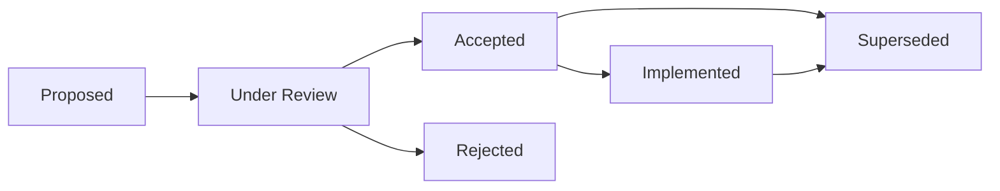

# Community Audit Documentation System

**Established:** 2025-01-26  
**Purpose:** Transparent decision tracking for Claude-assisted development methodology  
**Scope:** All architectural, technical, and strategic decisions affecting project direction

## Overview

This documentation system provides complete transparency into the decision-making process for Floating Bujo, a Claude-assisted open source project. Every significant decision is documented with full rationale, alternative considerations, and future implications to enable community audit and learning.

## Documentation Structure

```
docs/community/
├── README.md                    # This overview document
├── decisions/                   # Decision tracking and rationale
│   ├── architecture/           # Technical architecture decisions
│   ├── requirements/           # Requirements and scope decisions
│   ├── implementation/         # Development approach decisions
│   └── methodology/            # Claude-assisted process decisions
├── audit-trail/                # Chronological decision history
│   ├── 2025-01/               # Monthly decision archives
│   └── decision-index.md      # Searchable decision reference
├── rationale/                  # Deep-dive decision analysis
│   ├── technical-choices.md   # Technical decision explanations
│   ├── scope-decisions.md     # Feature scope rationale
│   └── process-evolution.md   # Methodology development
└── transparency/               # Community audit procedures
    ├── audit-procedures.md    # How to audit decisions
    ├── challenge-process.md   # How to challenge decisions
    └── decision-templates.md  # Standardized decision formats
```

## Decision Tracking Framework

### Decision Categories

**🏗️ Architecture Decisions (ADR)**
- Core system design choices
- Technology stack selections
- Security model decisions
- Performance trade-offs

**📋 Requirements Decisions (RDR)**
- Feature scope changes
- Priority adjustments
- MVP boundary definitions
- User story modifications

**⚡ Implementation Decisions (IDR)**
- Development approach choices
- Code pattern selections
- Tool and library decisions
- Testing strategy choices

**🔬 Methodology Decisions (MDR)**
- Claude-assisted process evolution
- Prompt engineering patterns
- Human-AI collaboration approaches
- Documentation standards

### Decision Status Lifecycle



**Status Definitions:**
- **Proposed:** Initial decision proposal with basic rationale
- **Under Review:** Community discussion and evaluation period
- **Accepted:** Decision approved for implementation
- **Rejected:** Decision declined with documented reasons
- **Implemented:** Decision put into practice
- **Superseded:** Decision replaced by newer decision

## Decision Documentation Standard

### Required Elements

Every decision must include:

1. **Decision ID:** Unique identifier (e.g., ADR-001, RDR-003)
2. **Title:** Clear, descriptive decision name
3. **Date:** Decision made date and review dates
4. **Status:** Current lifecycle status
5. **Context:** Situation requiring the decision
6. **Decision:** What was decided
7. **Rationale:** Why this decision was made
8. **Alternatives:** Other options considered
9. **Consequences:** Implications and trade-offs
10. **Future Impact:** Long-term considerations

### Template Format

```markdown
# [Category]-[Number]: [Decision Title]

**Date:** YYYY-MM-DD  
**Status:** [Proposed|Under Review|Accepted|Rejected|Implemented|Superseded]  
**Reviewers:** [List of reviewers]  
**Related Decisions:** [Links to related decisions]

## Context
[What situation led to this decision need?]

## Decision
[What exactly was decided?]

## Rationale
[Why was this the best choice?]

## Alternatives Considered
[What other options were evaluated and why were they rejected?]

## Consequences
### Positive
- [Benefit 1]
- [Benefit 2]

### Negative
- [Trade-off 1]
- [Risk 1]

### Neutral
- [Neutral impact 1]

## Implementation Impact
[How does this affect current implementation?]

## Future Implications
[How might this affect future decisions?]

## Success Criteria
[How will we know this decision was correct?]

## Review Schedule
[When should this decision be reconsidered?]
```

## Rationale-Focused Documentation

### Why Rationale Matters

In Claude-assisted development, understanding *why* decisions were made is crucial for:
- **Learning from AI collaboration patterns**
- **Validating prompt engineering approaches**
- **Enabling community contributions**
- **Preventing decision reversal without context**

### Rationale Documentation Requirements

**Technical Rationale:**
- Performance implications
- Security considerations
- Maintainability impact
- Scalability factors

**Methodological Rationale:**
- Claude Code effectiveness
- Prompt pattern success
- Human-AI collaboration lessons
- Development velocity impact

**Strategic Rationale:**
- Project vision alignment
- Community impact
- Resource constraints
- Timeline considerations

## Transparency Standards

### Public Decision Making

All decisions are made transparently:
- **Open discussion** in GitHub Issues/Discussions
- **Public rationale** documented before implementation
- **Community input** welcomed and considered
- **Decision audit trail** permanently preserved

### Access and Discoverability

- **Searchable index** of all decisions
- **Cross-referencing** between related decisions
- **Timeline view** of decision evolution
- **Category filtering** for specific decision types

### Community Audit Rights

The community can:
- **Review any decision** with full context
- **Challenge decisions** through documented process
- **Propose alternative approaches** with rationale
- **Track implementation** against decisions

## Future Reference System

### Decision Archive Organization

**Chronological Archive:**
- Monthly folders with all decisions
- Timeline view of project evolution
- Decision frequency and pattern analysis

**Category Archive:**
- Architecture decisions by component
- Requirements decisions by feature
- Implementation decisions by phase
- Methodology decisions by pattern

**Impact Archive:**
- High-impact decisions with ongoing effects
- Superseded decisions with replacement rationale
- Failed decisions with lessons learned

### Search and Reference

**Decision Index:**
- Searchable by keyword, category, date
- Cross-referenced by impact and relationship
- Tagged by Claude-assisted methodology elements

**Quick Reference:**
- Current active decisions summary
- Recent decision highlights
- Pending review decisions

## Community Audit Procedures

### How to Audit Decisions

1. **Access decision documentation** in relevant category
2. **Review rationale and alternatives** considered
3. **Check implementation alignment** with decision
4. **Evaluate outcome** against success criteria
5. **Document findings** using audit template

### Decision Challenge Process

1. **Review existing rationale** thoroughly
2. **Identify specific concerns** with current decision
3. **Propose alternative approach** with full rationale
4. **Submit challenge** via GitHub Discussion
5. **Participate in community review** process
6. **Accept final community decision** or fork project

### Audit Documentation

All audits are documented:
- **Audit findings** with specific observations
- **Community discussion** records preserved
- **Decision outcomes** clearly documented
- **Process improvements** identified and implemented

## Claude-Native Methodology Tracking

### AI Collaboration Decisions

Special attention to decisions involving:
- **Prompt engineering patterns**
- **Human-AI task distribution**
- **Claude Code usage strategies**
- **Validation and review processes**

### Methodology Evolution

Track how Claude-assisted approaches evolve:
- **Successful patterns** documented and reused
- **Failed approaches** analyzed for lessons
- **Process improvements** implemented iteratively
- **Community learning** shared transparently

## Getting Started

### For Contributors
1. **Read decision templates** to understand standards
2. **Review recent decisions** to understand current direction
3. **Propose new decisions** using standard format
4. **Participate in decision reviews** constructively

### For Auditors
1. **Start with decision index** for overview
2. **Focus on high-impact decisions** first
3. **Use audit procedures** for systematic review
4. **Document findings** for community benefit

### For Future Reference
1. **Bookmark decision categories** relevant to your work
2. **Subscribe to decision discussions** for updates
3. **Reference decisions** when making related choices
4. **Contribute lessons learned** from implementation

---

**This documentation system ensures that every decision in Floating Bujo's development is transparent, well-reasoned, and auditable by the community. It serves as both a historical record and a learning resource for advancing Claude-assisted development methodology.**