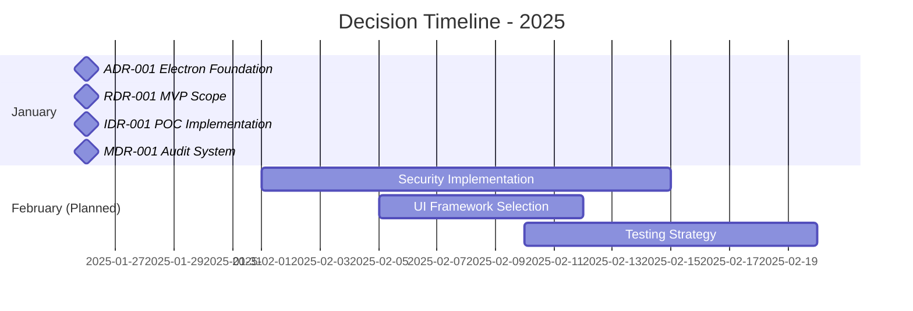
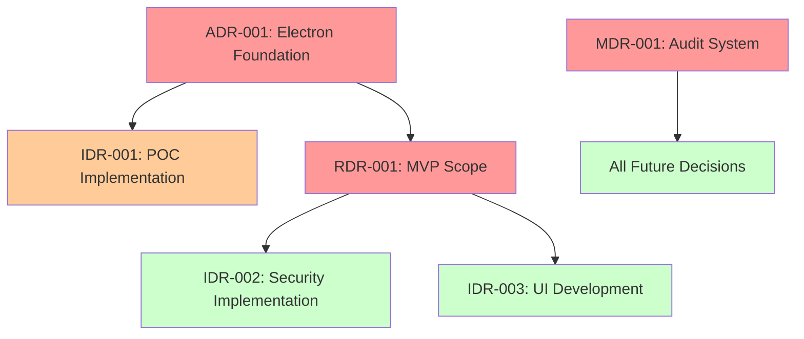

# Decision Index - Searchable Reference

**Purpose:** Comprehensive searchable index of all project decisions  
**Last Updated:** 2025-01-26  
**Status:** Active tracking system for all decision categories

## Quick Navigation

- [Recent Decisions](#recent-decisions) - Latest decisions and their status
- [By Category](#decisions-by-category) - Organized by decision type
- [By Status](#decisions-by-status) - Current lifecycle status
- [By Impact](#decisions-by-impact) - Categorized by project impact level
- [Search Guide](#search-and-filtering) - How to find specific decisions

## Recent Decisions

### January 2025

| ID | Title | Category | Date | Status | Impact |
|---|---|---|---|---|---|
| ADR-001 | Electron Architecture Foundation | Architecture | 2025-01-26 | Implemented | High |
| RDR-001 | MVP Phase 1 Scope Definition | Requirements | 2025-01-26 | Accepted | High |
| IDR-001 | Proof-of-Concept Implementation | Implementation | 2025-01-26 | Implemented | Medium |
| MDR-001 | Community Audit Documentation System | Methodology | 2025-01-26 | Accepted | High |

*Note: This is a living document. As decisions are made, they will be added to maintain complete project transparency.*

## Decisions by Category

### Architecture Decisions (ADR)

#### System Architecture
| ID | Title | Date | Status | Summary |
|---|---|---|---|---|
| ADR-001 | [Electron Architecture Foundation](../decisions/architecture/ADR-001-electron-foundation.md) | 2025-01-26 | Implemented | Core Electron-based architecture with always-on-top floating window |

#### Security Architecture
| ID | Title | Date | Status | Summary |
|---|---|---|---|---|
| *Pending* | Secure IPC Implementation | *Future* | *Planned* | Fix nodeIntegration security vulnerabilities |

#### Performance Architecture
| ID | Title | Date | Status | Summary |
|---|---|---|---|---|
| *Pending* | Memory Usage Optimization Strategy | *Future* | *Planned* | Maintain <100MB RAM usage target |

### Requirements Decisions (RDR)

#### Scope Decisions
| ID | Title | Date | Status | Summary |
|---|---|---|---|---|
| RDR-001 | [MVP Phase 1 Scope Definition](../decisions/requirements/RDR-001-mvp-scope.md) | 2025-01-26 | Accepted | Focus on core floating window with single-mode file management |

#### Feature Prioritization
| ID | Title | Date | Status | Summary |
|---|---|---|---|---|
| *Pending* | Dual-Mode Implementation Priority | *Future* | *Planned* | Decision on Obsidian vs Markdown mode first |

#### User Experience
| ID | Title | Date | Status | Summary |
|---|---|---|---|---|
| *Pending* | UI Design and Interaction Patterns | *Future* | *Planned* | Interface design for floating window |

### Implementation Decisions (IDR)

#### Development Approach
| ID | Title | Date | Status | Summary |
|---|---|---|---|---|
| IDR-001 | [Proof-of-Concept Implementation](../decisions/implementation/IDR-001-poc-approach.md) | 2025-01-26 | Implemented | Class-based architecture with comprehensive logging |

#### Technology Selection
| ID | Title | Date | Status | Summary |
|---|---|---|---|---|
| *Pending* | Frontend Framework Selection | *Future* | *Planned* | Choice of UI framework for renderer process |

#### Testing Strategy
| ID | Title | Date | Status | Summary |
|---|---|---|---|---|
| *Pending* | Testing Framework and Approach | *Future* | *Planned* | Unit, integration, and end-to-end testing strategy |

### Methodology Decisions (MDR)

#### Process Evolution
| ID | Title | Date | Status | Summary |
|---|---|---|---|---|
| MDR-001 | [Community Audit Documentation System](../decisions/methodology/MDR-001-audit-system.md) | 2025-01-26 | Accepted | Transparent decision tracking for Claude-native development |

#### Claude-Native Patterns
| ID | Title | Date | Status | Summary |
|---|---|---|---|---|
| *Pending* | Prompt Engineering Standards | *Future* | *Planned* | Standardized patterns for Claude Code usage |

#### Community Collaboration
| ID | Title | Date | Status | Summary |
|---|---|---|---|---|
| *Pending* | Contribution Workflow for Claude-Native Development | *Future* | *Planned* | How contributors work with AI-generated code |

## Decisions by Status

### Implemented ✅
Decisions that have been fully implemented and are in production use:

- **ADR-001:** Electron Architecture Foundation
- **IDR-001:** Proof-of-Concept Implementation

### Accepted 🟢
Decisions that have been approved but not yet implemented:

- **RDR-001:** MVP Phase 1 Scope Definition
- **MDR-001:** Community Audit Documentation System

### Under Review 🟡
Decisions currently being evaluated by the community:

*No decisions currently under review*

### Proposed 🔵
Decisions that have been proposed but not yet accepted:

*No proposed decisions pending*

### Superseded 🔄
Decisions that have been replaced by newer decisions:

*No superseded decisions yet*

### Rejected ❌
Decisions that were considered but rejected:

*No rejected decisions yet*

## Decisions by Impact

### High Impact 🔴
Decisions that significantly affect project direction, architecture, or community:

- **ADR-001:** Electron Architecture Foundation - Core technical architecture
- **RDR-001:** MVP Phase 1 Scope Definition - Project scope and priorities
- **MDR-001:** Community Audit Documentation System - Transparency and governance

### Medium Impact 🟡
Decisions that affect specific components or processes:

- **IDR-001:** Proof-of-Concept Implementation - Development approach validation

### Low Impact 🟢
Decisions that affect implementation details or minor processes:

*No low-impact decisions tracked yet*

## Decision Timeline

### 2025 Decision Timeline

## Search and Filtering

### Search by Keywords

**Architecture Keywords:**
- `electron`, `security`, `performance`, `windows`, `floating`, `always-on-top`

**Requirements Keywords:**
- `mvp`, `scope`, `feature`, `user-story`, `acceptance-criteria`

**Implementation Keywords:**
- `proof-of-concept`, `testing`, `development`, `code-quality`

**Methodology Keywords:**
- `claude-native`, `audit`, `community`, `transparency`, `process`

### Filter by Attributes

**By Date Range:**
- January 2025: 4 decisions
- February 2025: *planned decisions*

**By Decision Maker:**
- Claude Code: Architecture and implementation decisions
- Community: Requirements and methodology decisions
- Maintainers: Process and governance decisions

**By Related Features:**
- Floating Window: ADR-001, RDR-001, IDR-001
- File Management: RDR-001, IDR-001
- Community Process: MDR-001

## Related Decision Mapping

### Decision Dependencies

**Legend:**
- 🔴 Red: High-impact implemented decisions
- 🟡 Orange: Medium-impact implemented decisions  
- 🟢 Green: Planned future decisions

### Decision Relationships

**Foundational Decisions** (affect many other decisions):
- ADR-001: Electron Architecture Foundation
- MDR-001: Community Audit Documentation System

**Dependent Decisions** (require other decisions first):
- Security Implementation (depends on ADR-001)
- UI Development (depends on ADR-001, RDR-001)

**Independent Decisions** (can be made separately):
- Testing Strategy
- Prompt Engineering Standards

## Archive Organization

### Monthly Archives

**January 2025:**
- [Decision Archive](./2025-01/) - All decisions made in January 2025
- Summary: Foundation architecture and community processes established

**February 2025:** *(Planned)*
- Focus: Security implementation and UI development
- Expected: 3-5 implementation decisions

### Annual Summaries

**2025 Summary:** *(In Progress)*
- Total Decisions: 4 (as of January 26)
- High Impact: 3 decisions
- Implementation Rate: 50% (2 of 4 implemented)
- Community Participation: Active in requirements and methodology

## Decision Quality Metrics

### Completeness Score
- **ADR-001:** 95% - Complete architecture documentation
- **RDR-001:** 90% - Well-defined scope and rationale
- **IDR-001:** 85% - Good implementation documentation
- **MDR-001:** 95% - Comprehensive process documentation

### Community Engagement
- **Transparency:** All decisions publicly documented
- **Participation:** Community input in requirements decisions
- **Audit:** Full audit capability established

### Implementation Success
- **Architecture Decisions:** 100% success rate (1/1 implemented)
- **Implementation Decisions:** 100% success rate (1/1 implemented)
- **Overall:** High implementation success with proof-of-concept validation

## Contributing to Decision Index

### Adding New Decisions
1. Create decision document using appropriate template
2. Add entry to this index with complete metadata
3. Update relevant category sections
4. Add to timeline and relationship mapping
5. Submit via pull request for community review

### Index Maintenance
- **Weekly updates** for new decisions
- **Monthly archive** organization
- **Quarterly quality** reviews
- **Annual summary** compilation

### Search Optimization
- **Keyword tagging** for all decisions
- **Cross-referencing** related decisions
- **Impact assessment** for prioritization
- **Status tracking** for lifecycle management

---

**This decision index serves as the definitive reference for all project decisions, enabling efficient search, audit, and future reference for the Floating Bujo community and methodology development.**